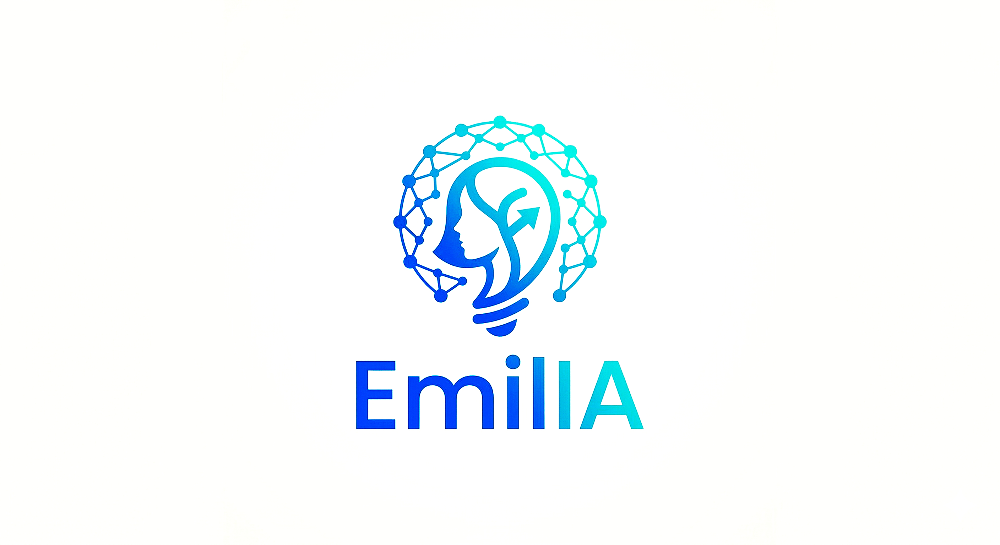

<p align="center">
  
</p>

# EmilIA 🤖🎙️

EmilIA é um assistente virtual de voz avançado que integra reconhecimento de fala em tempo real (STT), síntese de voz (TTS) e processamento de linguagem natural via modelos locais de IA.

## 🚀 Sobre o Projeto

O projeto combina diversas tecnologias de ponta para criar uma experiência de interação fluida por voz:

- **LLM:** Utiliza o [Ollama](https://ollama.com/) para rodar modelos como `gemma3:4b`.
- **STT (Speech-to-Text):** Implementado com `faster-whisper` para transcrição rápida e precisa.
- **TTS (Text-to-Speech):** Utiliza o `Piper` para síntese de voz local de alta performance.
- **Ferramentas Integradas:** Capacidade de tirar screenshots, realizar pesquisas na web e executar cálculos matemáticos.
- **Roteamento de Áudio:** Configurado para trabalhar com drivers MME (como VB-Audio Cable ou Voicemeeter).

## 🛠️ Requisitos

Antes de começar, você precisará ter:

1.  **Python 3.10+**
2.  **[uv](https://docs.astral.sh/uv/)** (Gerenciador de pacotes e ambientes Python)
3.  **[Ollama](https://ollama.com/)** instalado e rodando.
4.  **Drivers de Áudio Virtual** (Opcional, mas recomendado para roteamento):
    - [VB-Audio Virtual Cable](https://vb-audio.com/Cable/)
    - [Voicemeeter](https://vb-audio.com/Voicemeeter/)
5.  **Modelo Piper:** O arquivo `controle.onnx` deve estar na raiz do projeto para o funcionamento do TTS.

## 📦 Instalação

Com o `uv` instalado, a configuração é simples:

```bash
# Clone o repositório
git clone <url-do-repositorio>
cd EmilIA

# Instale as dependências e crie o ambiente virtual
uv sync
```

## 🖥️ Como Rodar

Certifique-se de que o **Ollama** está ativo em seu sistema.

Para iniciar o assistente, execute:

```bash
uv run main.py
```

O sistema irá:
1.  Verificar e baixar os modelos necessários no Ollama.
2.  Pré-carregar os modelos na memória (VRAM).
3.  Realizar um teste de áudio inicial.
4.  Ativar o "ouvinte" em tempo real.

## ⚙️ Configuração

### Arquivos de Sistema
- `sys.txt`: Contém o System Prompt do assistente principal.
- `sys_aux.txt`: Contém as instruções para a IA auxiliar de ferramentas.

### Modelos Utilizados
As variáveis no topo do `main.py` definem os modelos:
- `_main_model`: Padrão é `gemma3:4b`.
- `_aux_model`: Padrão é `func` modelo especializado em ferramentas. (EM DESENVOLVIMENTO)
### Dispositivos de Áudio
O projeto busca por dispositivos específicos no código:
- **Entrada:** "Voicemeeter Out B1" (MME)
- **Saída:** "CABLE Input (VB-Audio Virtual" (MME)

*Nota: Se você não utiliza esses drivers, será necessário ajustar as funções `_get_mic_index` e `_get_cable_index` no arquivo `main.py`.*

## 🧩 Funcionalidades Detalhadas

- **Conversação Contínua:** O assistente detecta silêncio para processar sua fala automaticamente.
- **Visão Computacional:** Peça para a EmilIA "ver sua tela" e ela tirará um screenshot para descrevê-lo.
- **Pesquisa Web:** Integração para buscar informações atualizadas na internet.
- **Saída Silenciosa:** Comandos como "sair", "exit" ou "desligar" encerram o processo de forma limpa.

---
Desenvolvido para ser um assistente local, privado e modular.
